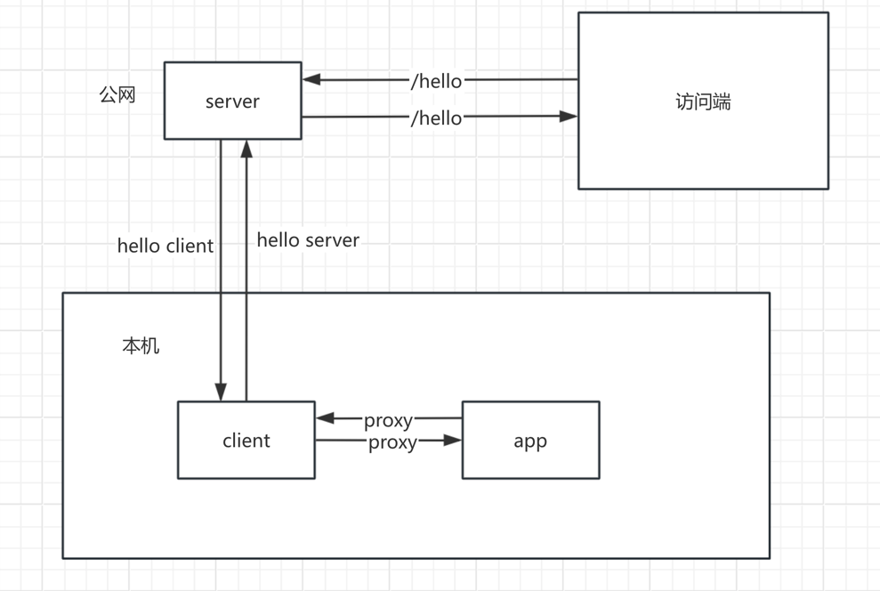

## 内网穿透原理

> 内网穿透本质上是端口映射，和 NAT 很像，但是 NAT 是通过交换机来实现的，而内网穿透是通过内网代理来实现的。

主要角色：

1. 服务端：监听访问端请求，将请求转发给客户端
2. 客户端：负责主动和服务端，应用端建立连接，充当服务器和应用端之间的桥梁。
3. 应用端：负责接收客户端转发的请求，真实处理请求。

主要代码

## vpn代理原理

### tun 程序示例

### networksetup 设置网络

